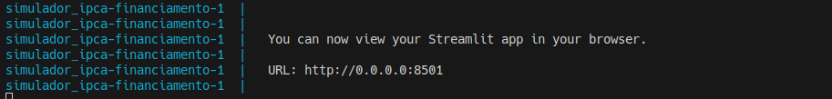

# Simulador_IPCA
 - Financiamento IPCA/Inflação
   - [Gestão Estratégica de Dados Corporativos](Gestão%20Estratégica%20de%20Dados%20Corporativos.pdf)

# Start projeto
```
docker-compose up --build
```
  - Acessar a url criada pelo ambiente:
  - 
## Implementação
 - 1- Baixar a base IPCA do BCB através da API
 - 2- Baixar a base IPCA do IBGE através da API
 - 3- Utilizar o Open metadados para gestão centralizada de metadados de dados
 - 4- Utilizar a linguagem python para:
    - Consumir as APIs
    - Limpeza e Preparação dos Dados
    - Criar o modelo de Projeção
    - Treinar o modelo
    - Projeção dos Custos e Capacidade de Pagamento
    - Análise de Cenários
    - Relatórios e Tomada de Decisão

# Referências

 - 1- [Banco Central do Brasil](https://www.bcb.gov.br/) 
 - 2- [IBGE](https://www.ibge.gov.br/)
 - 3- [OpenMetadata](https://open-metadata.org/)
 - 4- [API](https://apisidra.ibge.gov.br/values/t/1737/n1/all/v/all/p/all/d/v63%202,v69%202,v2266%2013,v2263%202,v2264%202,v2265%202?formato=json)